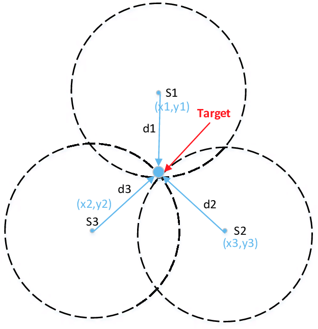

# 🌎 Trilateration on an Oblate Spheroid (Earth) using Python and Haversine formula

This Python code demonstrates how to perform trilateration on an oblate spheroid, such as the Earth. Trilateration is a method for determining an unknown location based on the distances from that location to known points.

The code takes three known points, their latitudes, longitudes, and distances to an unknown point. It then calculates the latitude, longitude of the unknown point using the Earth's oblate spheroid model.

## Dependencies

This code uses the following Python libraries:

- `math`: For mathematical calculations.
- `numpy`: For numerical operations.

Make sure to import these libraries before running the code.

## Usage

### Download the Repository

You can download the repository in one of the following ways:

#### Using Git

1. Clone the repository using Git by running the following command:

    ```bash
    git clone https://github.com/d4v1-sudo/trilateration-using-python.git
    ```

#### Downloading from the Website

1. Visit the GitHub repository page at [https://github.com/d4v1-sudo/trilateration-using-python.git](https://github.com/d4v1-sudo/trilateration-using-python.git).
2. Click the "Code" button and select "Download ZIP" to download the repository as a ZIP file.
3. Extract the contents of the ZIP file to your local machine.

### Install the Required Libraries

Before running the code, you need to install the necessary Python libraries. Open a terminal or command prompt and navigate to the project directory.

1. Run the following command to install the required libraries using pip:

    ```bash
    pip install -r requirements.txt
    ```

### Run the Code

1. In the terminal or command prompt, navigate to the project directory where you downloaded the repository.

2. Run the Python script by executing the following command:

    ```bash
    python3 trilateration.py
    ```

3. Follow the prompts to provide the coordinates (in decimal format) of reference points A, B, and C, as well as the distances from an unknown point to each of these points.

4. The script will calculate and print the geographic coordinates of the unknown point.

## Usage Example:

```
Latitude of point A: 37.7749
Longitude of point A: -122.4194
Distance from point A to the unknown point (in km): 10000.0

Latitude of point B: 34.0522
Longitude of point B: -118.2437
Distance from point B to the unknown point (in km): 15000.0

Latitude of point C: 40.7128
Longitude of point C: -74.0060
Distance from point C to the unknown point (in km): 12000.0
```

- To define N or S  /  E or W:

1. **Latitude (North/South):**
    - If the latitude is **positive**, it is in the Northern (N) hemisphere.
    - If the latitude is **negative**, it is in the Southern (S) hemisphere.

2. **Longitude (East/West):**
    - If the longitude is **positive**, it is in the Eastern (E) hemisphere.
    - If the longitude is **negative**, it is in the Western (W) hemisphere. 

## Code Explanation

This Python script is designed to calculate the coordinates of an unknown point on the Earth's surface using trilateration based on the distances to three known points (A, B, and C). The script incorporates measures of the Earth's polar and equatorial radii for improved accuracy.

Graphical demonstration of trilateration:



### Steps:

1. **Input Known Points and Distances**: The user provides the latitude, longitude, and distance from the unknown point to each of the three known points (A, B, and C).

2. **Conversion to Radians**: The script converts the latitude and longitude values of the known points from degrees to radians, as trigonometric functions in Python's math library expect inputs in radians.

3. **Cost Function**: The `cost_function` calculates the difference between the estimated distances from the unknown point to the known points and the actual measured distances. It uses the Numpy library for efficient array operations.

4. **Optimization**: The `minimize` function from the Scipy library is used to minimize the cost function. It attempts to find the coordinates of the unknown point that minimize the difference between the estimated and measured distances.

5. **Output**: Finally, the script prints the latitude and longitude coordinates of the unknown point.

### convert.py

This code provides functions to convert between decimal and sexagesimal representations of geographic coordinates (latitude and longitude).

To use it correctly:
1. Run the script.
   ```python3 convert.py <"-1" for decimal to sexagesimal or "-2" for sexagesimal to decimal>```
2. Follow the prompts:
   - For decimal to sexagesimal conversion, input latitude and longitude in decimal format (In the Southern hemisphere, use negative values for latitude, and in the Western hemisphere, use negative values for longitude). Example: `-15.7373` than `36.7289`
   - For sexagesimal to decimal conversion, input latitude and longitude in the specified sexagesimal format (N/S for latitude, and E/W for longitude). Example: `39º 42' 17'' N` than `22º 49' 52'' E`
3. The script will output the converted coordinates.

## Note

- Remember, to use geographic coordinates in ```trilateration.py```, decimal format is required. I made ```convert.py``` precisely for type compatibility issues, as my codes do not accept the sexagesimal system (XXº XX' XX'' N/S/E/W). Then use ```convert.py``` for testing and conversions.

- Ensure that you have installed the `numpy` library if it's not already installed on your system.

- This code is a valuable tool for determining the location of an unknown point on the Earth's surface based on distance measurements from known reference points.

## Contributions

Contributions are welcome! Feel free to open issues or send pull requests to enhance this project.

## License

This project is licensed under the [MIT License](LICENSE).


<a href="https://visitorbadge.io/status?path=https%3A%2F%2Fgithub.com%2Fd4v1-sudo%2Ftrilateration-using-python"></a>
